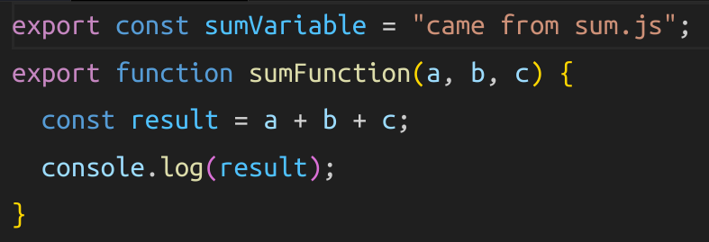
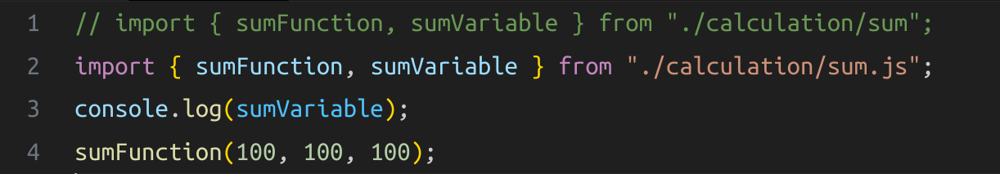

# Working with ejs required some steps

### Create a packge.json file in the root of project

```
{
 "type":"module"
}
```

### How you can export a variable and funtion in ejs



### How to import variable and function in ejs



> 1. Whatever written in Line#1 is wrong
>    becoz when we import it is very important to write .js after the file name where you import a file or module .
